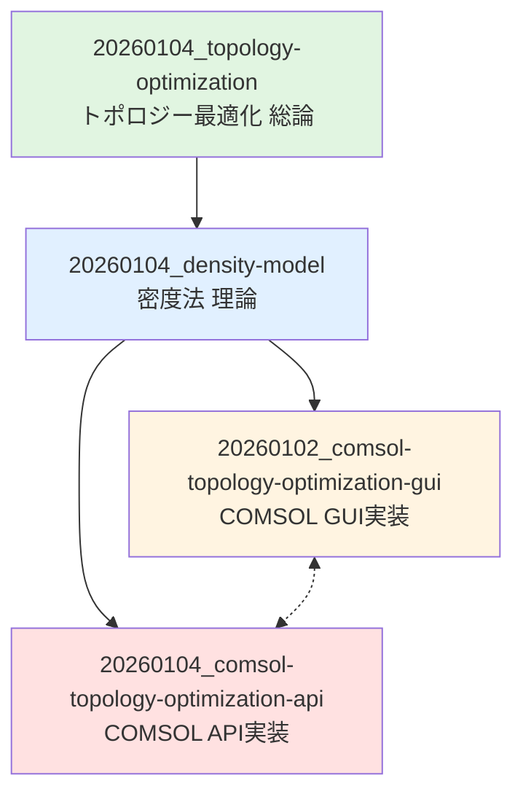

# COMSOLトポロジー最適化の学習体系

このノートは、COMSOLにおけるトポロジー最適化（密度法）の学習体系と、関連ノート間の関係性を整理したものです。

## 概要

COMSOLのOptimization Moduleでは、**密度法（Density Method）**によるトポロジー最適化が実装されています。この構造ノートでは、理論の理解から実践的な実装まで、段階的に学習できるようノートを体系化しています。

## 知識体系の全体像

```
トポロジー最適化（一般理論）
    ↓
密度法（数値手法の理論）
    ↓
COMSOL実装（2つのアプローチ）
    ├─ GUI実装（初級〜中級）
    └─ API実装（上級）
```

---

## 1. 理論の理解

トポロジー最適化の概念と数学的背景を学ぶ段階です。

### 1.1 トポロジー最適化の全体像
**[[20260104_topology-optimization]]** - トポロジー最適化（一般理論）

**内容:**
- トポロジー最適化とは何か
- メリット・デメリット
- 代表的な手法（密度法、レベルセット法、均質化法、ESO/BESO）
- 産業応用事例（航空宇宙、自動車、建築、医療、熱設計）

**学習目的:** トポロジー最適化の全体像を把握し、どのような問題に適用できるかを理解する

---

### 1.2 密度法の理論
**[[20260104_density-model]]** - 密度法（数値手法）

**内容:**
- 密度法の基本原理（離散問題の連続緩和）
- SIMP法（Solid Isotropic Material with Penalization）の数学的定式化
- 数値的課題と対策
  - チェッカーボードパターン
  - メッシュ依存性
  - 局所最適解
- フィルタリング技術（密度フィルタ、ヘビサイド射影法）
- 実装アルゴリズムの流れ
- 推奨パラメータ

**学習目的:** 密度法の数学的背景を理解し、なぜそのように実装するのかの理論的根拠を得る

**前提知識:** 有限要素法（FEM）の基礎、最適化理論の基本

---

## 2. COMSOL実装

理論を理解した上で、COMSOLで実際に実装する段階です。目的と習熟度に応じて2つのアプローチがあります。

### 2.1 GUI実装（推奨：初学者〜中級者）
**[[20260102_comsol-topology-optimization-gui]]** - COMSOL GUI実装ガイド

**対象者:**
- COMSOLを初めて使う方
- GUIで対話的に最適化を実行したい方
- トラブルシューティングしながら学びたい方

**内容:**
- 基本的なワークフロー（9ステップ）
- Density Model変数の設定方法
- 材料特性の密度依存定義（SIMP法の実装）
- 最適化設定（目的関数、制約、ソルバー）
- メッシュ設定の推奨事項
- 実践例：片持ち梁の最適化（ステップバイステップ）
- **トラブルシューティング**（5つの典型的問題と解決策）
- パフォーマンス最適化のヒント
- 発展的な応用（マルチフィジックス、複数荷重ケース）

**学習の流れ:**
1. 実践例（片持ち梁）を手順通りに実行
2. パラメータを変更して挙動を観察
3. トラブルシューティングで問題解決能力を養う
4. 発展的な応用に挑戦

**強み:**
- 視覚的に結果を確認しながら学べる
- パラメータの効果を即座に確認できる
- 豊富なトラブルシューティング情報

---

### 2.2 API実装（推奨：上級者）
**[[20260104_comsol-topology-optimization-api]]** - COMSOL Java API リファレンス

**対象者:**
- プログラミングで自動化したい方
- パラメトリックスタディを大量に実行したい方
- 再現性を重視する方
- カスタムワークフローを構築したい方

**内容:**
- DensityTopologyコマンドの完全なAPIリファレンス
- 全パラメータの詳細解説
  - interpolationType（SIMP、RAMP、Darcy、Linear）
  - filterType（Helmholtz、No_filter）
  - projectionType（TanhProjection、No_projection）
- 典型的な設定パターン（3種類のコード例）
- プログラミング時のベストプラクティス
  - 段階的なbeta増加（継続法）
  - パラメトリックスタディの自動化
  - 異なる補間法の比較
- 完全なJavaコード実例
- デバッグ方法

**学習の流れ:**
1. GUIで基本操作を習得してから取り組む
2. 完全なコード実例を実行して理解
3. パラメトリックスタディで自動化のメリットを体感
4. 自分のプロジェクトにカスタマイズ

**強み:**
- 完全な再現性（スクリプトで記録）
- 大規模なパラメトリックスタディが可能
- バージョン管理（Git等）で履歴管理
- カスタムワークフローの実現

---

## 3. 学習パスの推奨順序

### 初学者向けパス（推奨）

```
1. [[20260104_topology-optimization]]
   ↓ トポロジー最適化の全体像を理解

2. [[20260104_density-model]]
   ↓ 密度法の理論を学習（軽く読む程度でOK）

3. [[20260102_comsol-topology-optimization-gui]]
   ↓ GUIで実践（片持ち梁の例を実行）

4. 実践を繰り返す
   ↓ パラメータを変えて挙動を観察

5. [[20260104_comsol-topology-optimization-api]]
   ↓ 自動化が必要になったらAPI実装へ
```

**所要時間の目安:**
- ステップ1: 1時間
- ステップ2: 1〜2時間
- ステップ3: 2〜3時間（実際に手を動かす）
- ステップ4: 数日〜数週間（プロジェクト次第）
- ステップ5: 2〜4時間（Java基礎知識がある場合）

---

### 上級者向けパス（時間重視）

既にFEMやトポロジー最適化の知識がある場合：

```
1. [[20260104_density-model]]
   ↓ COMSOLでの実装の理論的背景を確認

2. [[20260102_comsol-topology-optimization-gui]]
   ↓ GUIで一度実行して感覚をつかむ

3. [[20260104_comsol-topology-optimization-api]]
   ↓ すぐにAPI実装に移行
```

---

## 4. ノート間のリンク関係



- **緑**: 一般理論
- **青**: 数値手法の理論
- **黄**: GUI実装（初級〜中級）
- **赤**: API実装（上級）
- **破線**: 相互参照（GUIとAPIは補完関係）

---

## 5. よくある質問

### Q1: GUIとAPIのどちらから始めるべきですか？
**A:** 初学者は必ずGUIから始めてください。GUIで結果を視覚的に確認しながら理解を深めた後、自動化が必要になったらAPIに移行するのが効率的です。

### Q2: 理論ノートは全部読む必要がありますか？
**A:** 初学者は[[20260104_topology-optimization]]を読んで全体像を把握し、[[20260104_density-model]]は「なぜこうするのか」を確認する参考資料として使うのがおすすめです。詳細は実践しながら必要に応じて読み返してください。

### Q3: COMSOLのライセンスがない場合は？
**A:** 理論ノート（[[20260104_topology-optimization]]、[[20260104_density-model]]）で数学的背景を学び、他のソフトウェア（MATLAB、Python等）で実装する際の参考にできます。

### Q4: GUIで十分な場合、APIは不要ですか？
**A:** はい。以下に該当しない限り、GUIで十分です：
- 100ケース以上のパラメトリックスタディを実行したい
- 完全な再現性が必要（論文投稿等）
- カスタムワークフローを構築したい

---

## 6. 関連リソース

### 公式ドキュメント
- COMSOL Multiphysics Documentation - Optimization Module User's Guide
- COMSOL Application Gallery - Topology Optimization Examples

### 参考文献
- Bendsøe, M.P., & Sigmund, O. (2003). "Topology Optimization: Theory, Methods and Applications"
- Sigmund, O. (2001). "A 99 line topology optimization code written in MATLAB"

### Webリソース
- [トポロジー最適化/ALTAIR](https://altairjp.co.jp/topology-optimization)
- COMSOL Blog - "Introduction to Topology Optimization"

---

## 更新履歴

- 2026-01-04: 初版作成
  - 4つのノートを体系化
  - 学習パスを明確化
  - GUI版とAPI版を明確に分離

---

**次のステップ:** まず [[20260104_topology-optimization]] を読んで、トポロジー最適化の全体像を把握しましょう。
