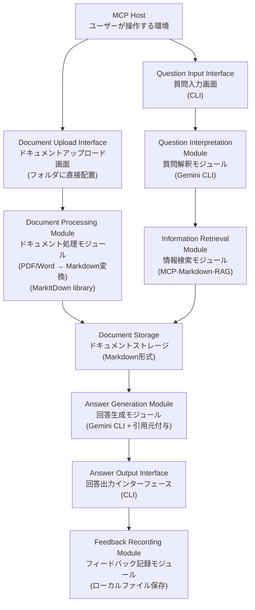
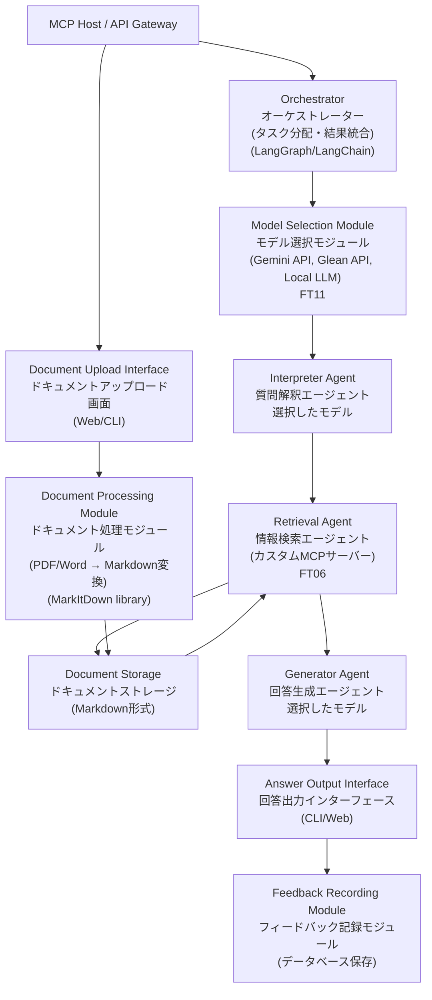

# Knowledge Retrieval Assistant System (知識検索アシスタントシステム)

## Project Overview(プロジェクト概要)

特定のドメインに関する質問に対して、ローカルまたはクラウド上のドキュメントから関連情報を検索し、コンテキストを付与した回答を生成する汎用的なRAGシステム。初期ユースケースはエラーハンドリング支援だが、アーキテクチャ設計、ビジネスロジック説明、技術ドキュメント検索など、様々なドメインに適用可能。

## Objectives (目的)

| Objective (目的) | Description (説明) | Success Criteria (成功基準) |
| :------- | :---------- | :--------------- |
| ドメイン知識へのアクセス時間を削減する | 質問から関連情報の取得までの時間を短縮する | ドキュメント検索時間を80%削減 |
| 「何がわからないかわからない」状態を解消する | 曖昧な質問を具体化し、適切な情報を提示する | 質問の再試行回数を50%削減 |
| 複数ドメインでの知識共有を促進する | 同じシステムで異なるドメインの知識ベースを管理する | 3つ以上のドメインで運用可能 |

## Timeline (タイムライン)

| Phase                | Start Date       | End Date       | Milestones                                                                                              |
| :------------------- | :--------------- | :------------- | :------------------------------------------------------------------------------------------------------ |
| Phase 1(設計フェーズ)      | 2025-12-29       | 2026-01-02     | - 全フェーズを大まかに設定する<br>- システム概念を構築する<br>- 機能・非機能要件の上限を設定する<br>- MCPサーバー選定方針を決定する                                 |
| Phase 2(検証・実装フェーズ)    | 2026-01-02       | 2026-02-02     | - MCP-Markdown-RAGを評価・導入<br>- ドメイン別ディレクトリ構造を構築<br>- ハイブリッド検索の精度評価<br>- CLI質問応答機能の実装<br>- フィードバック記録機能の実装<br>- **Phase 3移行判断** |
| Phase 3(拡張フェーズ) | 2026-02-02 | 2026-03-31 | - Phase 2評価結果に基づく選択:<br>  A) MCP-Markdown-RAG継続利用<br>  B) カスタムMCPサーバー実装<br>  C) フォーク&カスタマイズ<br>- API連携機能の実装<br>- 本格運用開始                         |

### Phase詳細

**Phase 1: 設計フェーズ（2025-12-29 - 2026-01-02）**
- 全体設計を行い、今後の方針を仮決定する
- MCPサーバー選定方針の決定
  - 公式mcp-markdown-ragの制約確認完了
  - MCP-Markdown-RAG採用決定（ハイブリッド検索・柔軟な設定）
- リポジトリ構造の設計

**Phase 2: 検証・実装フェーズ（2026-01-02 - 2026-02-02）**
- **Week 1: MCP-Markdown-RAGのセットアップと評価**
  - シンボリックリンク作成（MCP-Markdown-RAG/documents → data/documents）
  - config.toml設定とGemini CLI経由でのMCPツール呼び出し確認
  - ハイブリッド検索（BM25 + Semantic）の精度評価
  - 検索パラメータ（semantic_weight, keyword_weight等）のチューニング
- **Week 2-3: ドキュメント処理とCLI実装**
  - MarkItDown Pythonライブラリの統合（FT03）
  - ドメイン別ディレクトリ構造の構築（error-handling/architecture/etc）
  - CLI質問応答システムの実装（FT01, FT05, FT07, FT08）
- **Week 4: フィードバック機能とPhase 3判断**
  - フィードバック記録機能の実装（FT09）
  - サンプルドキュメントでの総合評価
  - Phase 3移行判断
- **Phase 2終了時の評価基準**:
  1. シンボリックリンク方式で運用可能か
  2. ドメイン別検索の精度が実用レベルか（関連文書Top 3含有率 >80%）
  3. 設定の柔軟性で要件を満たせるか
  4. カスタマイズが必要な機能の洗い出し

**Phase 3: 拡張フェーズ（2026-02-02 - 2026-03-31）**
- Phase 2の評価結果に基づく実装方針の選択:
  - **選択肢A**: MCP-Markdown-RAG継続（要件を満たした場合）
  - **選択肢B**: カスタムMCPサーバー実装（特化機能が必要な場合）
    - Frontmatterメタデータの高度なフィルタリング
    - ドメイン固有の重み付けロジック
    - 実装期間: 2-3週間
  - **選択肢C**: フォーク&カスタマイズ（部分的拡張が必要な場合）
- API連携機能の実装（Gemini API）
- 本格運用とフィードバック収集

## Risk Management (リスク管理)

### High Risk: MCP-Markdown-RAGが要件を満たさない
**影響**: Phase 2終了時に検索精度が不足し、Phase 3でのカスタム実装が必要になる

**対策**:
- **Week 1で早期評価を完了**
  - シンボリックリンクによるセットアップ（設定のみ、1時間以内）
  - サンプルドキュメント3-5件で検索精度を即座に確認
  - ハイブリッド検索（BM25 + Semantic）の効果測定
- **評価基準を明確化**
  - 関連文書がTop 3に含まれる率 >80%
  - 応答速度 <10秒
  - config.tomlでの設定柔軟性確認
- **Phase 3バッファ確保**
  - カスタム実装が必要な場合の時間を予め確保（2-3週間）
  - フォールバック: MCP-Markdown-RAGをフォークして1行修正（絶対パス対応のみ必要な場合）

### Medium Risk: 既存ドキュメントの品質不足
**影響**: ドキュメントの質が低いと、どれだけ検索精度を上げても有用な回答が得られない

**対策**:
- Phase 2開始前にサンプルドキュメントを準備（各ドメイン3-5件）
- ドキュメント作成ガイドラインを策定（構造化、メタデータ付与）
- Phase 2でフィードバックログを分析し、不足ドキュメントを特定

### Low Risk: 修論・就活との時間競合
**影響**: Phase 2/3の実装期間が延びる可能性

**対策**:
- Phase 2を最小機能セット（MVP）に絞る
- 週単位でのマイルストーン管理
- Phase 3のカスタム実装は「必要な場合のみ」とし、無理に実装しない


# Design

## ユーザージャーニーマッピング

ペルソナ
- 初めての分野を学習する
- 周りに質問できる相手がいない

> [!timeline|red] 疑問を抱く
> IT製品や論文についての疑問を抱き、質問したいと思うが何を聞けばいいかがわからなくなる

> [!timeline|blue] 曖昧な質問
> エラーコードだけなどの曖昧さを残してシステムに対して質問する

> [!timeline|green] 質問の解釈
> LLMモデルを用いて、曖昧な質問を深掘りすることでその真意を解釈する

> [!timeline|green] 適切な情報の探索
> 解釈した質問をもとに、解決に必要とする情報をストレージを探索して見つける

> [!timeline|blue] 解決策の提示
> 情報から分析したエラー原因と解決策3つをシステムが提示する

> [!timeline|red] 解決策の試行
> 提示された解決策をユーザーが試してみてその結果を判断する

> [!timeline|green] 解決策の貯蔵
> 解決した場合にはその解決策を記載する。その際、LLMを用いてエラー原因を記述する

## Features

| カテゴリ | 機能ID | 機能名 | 説明 | 実装詳細 |
| :--- | :--- | :--- | :--- | :--- |
| 入力系 | FT01 | 質問入力 | ユーザーがドメイン固有の質問を入力する機能 | Phase2: CLIベースでの実装 |
| データ準備系 | FT02 | ドキュメントアップロード | PDF・Word・Markdownファイルをシステムに取り込む機能 | Phase2: フォルダに直接配置する形で対応 |
| データ準備系 | FT03 | ドキュメント処理 | アップロードされたドキュメントをMarkdown形式に変換・正規化する機能 | **Phase2**: MarkItDown Pythonライブラリを直接使用（markdownify-mcp不使用） |
| データ準備系 | FT04 | ドメインメタデータ付与 | ドキュメントにドメイン分類とタグを付与する機能 | LLMによる自動分類またはマニュアル設定 |
| 処理系 | FT05 | 質問解釈 | 曖昧な質問をLLMで解釈し、具体的な質問に変換する機能 | Phase2: Gemini CLI<br/>Phase3: API連携 |
| 処理系 | FT06 | ドメイン別検索 | 質問内容に基づいて関連ドキュメントを検索する機能 | **Phase2**: MCP-Markdown-RAG（ハイブリッド検索・config.toml設定）<br/>**Phase3評価後**: 必要に応じてカスタムMCPサーバー実装 |
| 処理系 | FT07 | 回答生成 | 検索結果から回答を生成し、引用元情報を付与する機能 | LLMによる回答生成と引用元付与 |
| 出力系 | FT08 | 回答出力 | 生成された回答をユーザーに表示する機能 | Phase2: CLI出力 |
| 出力系 | FT09 | フィードバック記録 | ユーザーの回答評価（有用/無用）を記録する機能 | 次回の検索精度向上に活用 |
| 管理系 | FT10 | ドメイン設定管理 | 利用可能なドメインと検索対象ディレクトリを管理する機能 | **Phase2**: ディレクトリ構造による暗黙的管理（MCP-Markdown-RAGの検索範囲設定）<br/>**Phase3（カスタム実装時のみ）**: domains.yml等による明示的管理 |
| 連携系 | FT11 | 外部API連携 | Gemini API、Glean API, LocalLLM等の外部APIと連携する機能 | **Phase3のみ**: API呼び出しラッパー、レート制限管理、エラーハンドリング |
| アーキテクチャ系 | FT12 | オーケストレーター | 複数エージェント（質問解釈、検索、回答生成）を統合管理する機能 | **Phase3のみ**: エージェント間通信、タスク分配、結果統合 |
| アーキテクチャ系 | FT13 | エージェント実装 | 各専門タスクを担当するエージェント（Interpreter Agent, Retrieval Agent, Generator Agent） | **Phase3のみ**: LangGraph/LangChainベースのエージェント実装 |

## Architecture Diagram

### Phase 2: シンプルな直列処理アーキテクチャ



### Phase 3: エージェント・オーケストレーター構成（選択的実装）



### モジュール詳細

| モジュール名 | 説明 | 実装詳細 | 対応機能 |
| :--- | :--- | :--- | :--- |
| Question Input Interface<br/>質問入力画面 | ユーザーが質問を入力するインターフェース | Phase2: CLIベースでの実装 | FT01 |
| Document Upload Interface<br/>ドキュメントアップロード画面 | ユーザーがドキュメントをアップロードするインターフェース | PDFファイル・wordファイルをフォルダに直接配置 | FT02 |
| Document Processing Module<br/>ドキュメント処理モジュール | アップロードされたドキュメントを解析し、markdownファイルに変換して保存するモジュール | **Phase2**: MarkItDown Pythonライブラリを直接使用 | FT03 |
| Past Case Documentation Module<br/>過去事例ドキュメント化モジュール | 過去の対応事例を記載した文書から、エラー原因と解決策を抽出してmarkdownファイルに保存するモジュール | LLMによる抽出処理 | FT04 |
| Question Interpretation Module<br/>質問解釈モジュール | 曖昧な質問をLLMを用いて解釈し、具体的な質問に変換するモジュール | Phase2: Gemini CLI（main.pyから呼び出し）<br/>Phase3: API連携（専用モジュール） | FT05 |
| Information Retrieval Module<br/>情報検索モジュール | 質問内容に基づいて、過去の対応事例やマニュアルなどのドキュメントを検索するモジュール | Phase2: Gemini CLIが内部でMCP-Markdown-RAG呼び出し（ハイブリッド検索）<br/>Phase3評価後: カスタムMCPサーバー検討 | FT06 |
| Document Storage<br/>ドキュメントストレージ | 解析されたドキュメントを保存するストレージ | Markdown形式で保存 | FT02, FT03, FT04 |
| Answer Generation Module<br/>回答生成モジュール | 検索したドキュメントの中から、回答に引用元の場所を付与して提示するモジュール | Phase2: Gemini CLI（検索結果を基に回答生成）<br/>Phase3: API連携（専用モジュール） | FT07 |
| Answer Output Interface<br/>回答出力インターフェース | ユーザーに回答を提示するインターフェース | Phase2: CLI出力 | FT08 |
| Feedback Recording Module<br/>フィードバック記録モジュール | ユーザーの解決結果を記録するモジュール | Phase2: ローカルファイル保存 | FT09 |

## Repository Structure (レポジトリ構成)

```
knowledge-retrieval-assistant/
├── README.md                 # プロジェクト概要とセットアップ手順
├── GEMINI.md                 # Gemini CLIに対するレポジトリ説明ドキュメント
├── .gitignore               # Git除外設定
├── .python-version          # Python バージョン指定（uvで使用）
├── pyproject.toml           # プロジェクト設定とuv依存関係管理
├── uv.lock                  # uvロックファイル（自動生成）
├── config/                  # 設定ファイル
│   ├── config.toml         # Phase2: MCP-Markdown-RAG設定
│   ├── domains.yml         # Phase3: カスタムMCPサーバー用ドメイン定義（選択肢B/C時のみ）
│   ├── mcp_config.json     # MCP設定
│   └── gemini_config.json  # Gemini CLI設定
├── docs/
│   └── architecture_diagram.md  # アーキテクチャ図と説明
├── src/                     # ソースコード（Phase2では最小構成）
│   ├── kra/                # メインパッケージ（Knowledge Retrieval Assistant）
│   │   ├── __init__.py
│   │   ├── main.py         # エントリーポイント（ユーザー入力 → Gemini CLI呼び出し → 出力）
│   │   ├── cli/            # CLI関連（ユーザーインターフェース層）
│   │   │   ├── __init__.py
│   │   │   ├── input.py    # 質問入力（FT01）
│   │   │   └── output.py   # 回答出力（FT08）
│   │   ├── processing/     # 処理系（Gemini CLI呼び出しラッパー）
│   │   │   ├── __init__.py
│   │   │   ├── interpreter.py  # Phase2: 不要またはプロンプトテンプレート管理のみ（FT05）
│   │   │   ├── retrieval.py    # Phase2: 不要（Gemini CLIが内部で実行）（FT06）
│   │   │   └── generator.py    # Phase2: Gemini CLI呼び出し（subprocess）（FT07）
│   │   ├── data/           # データ準備系（Phase2では手動配置中心）
│   │   │   ├── __init__.py
│   │   │   ├── uploader.py     # ドキュメントアップロード（FT02）
│   │   │   ├── processor.py    # ドキュメント処理（FT03）
│   │   │   └── metadata.py     # メタデータ付与（FT04）
│   │   ├── domain/         # Phase3: カスタムMCPサーバー用（選択肢B/C時のみ）
│   │   │   ├── __init__.py
│   │   │   ├── manager.py      # ドメイン設定管理（FT10）
│   │   │   └── schemas.py      # ドメイン定義スキーマ
│   │   ├── orchestrator/   # Phase3: オーケストレーター（FT12）
│   │   │   ├── __init__.py
│   │   │   ├── orchestrator.py # オーケストレーターメイン
│   │   │   ├── agents/         # エージェント実装（FT13）
│   │   │   │   ├── __init__.py
│   │   │   │   ├── interpreter_agent.py  # 質問解釈エージェント
│   │   │   │   ├── retrieval_agent.py    # 検索エージェント
│   │   │   │   └── generator_agent.py    # 回答生成エージェント
│   │   │   └── workflow.py     # LangGraph/LangChainワークフロー定義
│   │   ├── api/            # Phase3: 外部API連携（FT11）
│   │   │   ├── __init__.py
│   │   │   ├── gateway.py      # API統一インターフェース
│   │   │   ├── gemini_client.py    # Gemini API呼び出し
│   │   │   ├── glean_client.py     # Glean API呼び出し（オプション）
│   │   │   ├── local_llm_client.py # Local LLM呼び出し
│   │   │   ├── rate_limiter.py     # レート制限管理
│   │   │   └── retry_handler.py    # リトライロジック
│   │   └── utils/          # ユーティリティ
│   │       ├── __init__.py
│   │       ├── mcp_client.py   # MCP連携
│   │       └── feedback.py     # フィードバック記録（FT09）
├── data/                    # データストレージ
│   ├── documents/          # ドメイン別ドキュメント（Phase2: ディレクトリ構造による暗黙的管理）
│   │   ├── error-handling/ # エラーハンドリングドメイン
│   │   ├── architecture/   # アーキテクチャドメイン
│   │   ├── api-guides/     # API利用ガイドドメイン
│   │   └── business-logic/ # ビジネスロジックドメイン
│   ├── uploads/            # アップロード元ファイル（PDF/Word）
│   ├── .rag_cache/         # Phase2: MCP-Markdown-RAGが生成するベクトルDB
│   └── feedback/           # フィードバックログ
├── scripts/                 # スクリプト
│   ├── setup.sh            # 初期セットアップ
│   └── convert_docs.sh     # ドキュメント一括変換
└── tests/                   # テストコード
    ├── __init__.py
    ├── test_cli.py
    ├── test_processing.py
    └── test_data.py
```

### ディレクトリ説明

| ディレクトリ | 説明 | 対応機能 |
| :--- | :--- | :--- |
| `config/` | Phase2: config.toml（MCP-Markdown-RAG設定）、gemini_config.json（Gemini CLI設定）<br/>Phase3: domains.yml追加（カスタム実装時のみ） | 全機能、特にFT10 |
| `src/cli/` | ユーザーインターフェース（入出力）- main.pyから呼び出される | FT01, FT08 |
| `src/processing/` | Phase2: Gemini CLI呼び出しラッパー（プロンプト管理、subprocess実行）<br/>Phase3: API連携モジュール | FT05, FT06, FT07 |
| `src/data/` | ドキュメントアップロード・処理・メタデータ付与 | FT02, FT03, FT04 |
| `src/domain/` | Phase3: カスタムMCPサーバー用（選択肢B/C時のみ実装） | FT10（Phase3） |
| `src/orchestrator/` | Phase3: オーケストレーター&エージェント実装 | FT12, FT13 |
| `src/api/` | Phase3: 外部API連携（Gemini/Glean/Local LLM） | FT11 |
| `src/utils/` | フィードバック記録、設定管理 | FT09 |
| `data/documents/` | ドメイン別に分類された変換済みMarkdownファイル<br/>Phase2: ディレクトリ構造による暗黙的ドメイン管理<br/>Gemini CLI（MCP-Markdown-RAG）が参照 | FT02, FT03, FT04, FT06 |
| `data/uploads/` | アップロードされたPDF/Wordファイルの保存先 | FT02 |
| `data/.rag_cache/` | Phase2: MCP-Markdown-RAGが自動生成するベクトルDB<br/>Gemini CLIが内部的に利用 | FT06 |
| `data/feedback/` | ユーザーのフィードバックログ（main.pyが記録） | FT09 |
| `scripts/` | セットアップ、ドキュメント変換スクリプト | - |
| `tests/` | ユニットテスト・統合テスト | - |

## 機能要件


## 非機能要件


## Phase 2における実装方針の整理

### main.pyを中心とした実装フロー

Phase 2では、main.pyがシステム全体のエントリーポイントとして機能し、複数のCLIツールやMCPサーバーを呼び出します。

**実装フロー**:
```
ユーザー
  ↓ 質問を入力 or ドキュメントアップロード
main.py (Python アプリケーション)
  ├─ [質問応答フロー]
  │   ↓ 1. input.pyで質問受け取り
  │   ↓ 2. generator.pyでGemini CLI呼び出し（subprocess）
  │   │    → Gemini CLI内部でMCP-Markdown-RAG呼び出し（検索 + 回答生成）
  │   ↓ 3. output.pyで結果表示
  │   ↓ 4. feedback.pyでフィードバック記録
  │
  └─ [ドキュメント処理フロー]
      ↓ 1. uploader.pyでファイル受け取り
      ↓ 2. processor.pyでMarkItDownライブラリを直接呼び出し（PDF/Word → Markdown変換）
      ↓ 3. metadata.pyでメタデータ付与（LLM利用）
      ↓ 4. data/documents/へ保存
ユーザー
```

**main.pyが呼び出すツール・ライブラリ**:
- **Gemini CLI**: 質問応答処理（質問解釈 + 検索 + 回答生成）
- **MarkItDown (Pythonライブラリ)**: ドキュメント変換（PDF/Word → Markdown）
- **LLM（Gemini CLI経由）**: メタデータ自動付与、フロントマター生成

**重要な設計判断**:
- **MCPサーバー呼び出し**: Pythonコードから直接呼び出すのではなく、Gemini CLIがMCPサーバーと連携
- **質問解釈**: Gemini CLIに適切なプロンプトテンプレートを渡すことで実現
- **検索 + 回答生成**: Gemini CLIが一括で処理（内部でMCP-Markdown-RAGから情報を取得し、回答を生成）
- **main.pyの役割**: ユーザーインターフェース（入出力）とCLIツール/ライブラリの呼び出し制御

このアプローチにより、Phase 2では複雑な処理を既存のCLIツールに委譲し、Pythonアプリケーションは薄いオーケストレーション層として機能します。

---

### MCP-Markdown-RAGのセットアップ方針

**Phase 2における外部MCPサーバーの利用方法**

MCP-Markdown-RAGをMCPサーバーとして評価するため、以下の方法でセットアップします:

**1. シンボリックリンクによるドキュメント共有**

```bash
# MCP-Markdown-RAG直下にシンボリックリンクを作成
cd ~/dev/mcp-servers/MCP-Markdown-RAG
ln -s path/to/knowledge-retrieval-assistant/data/documents documents
```

**理由**:
- MCP-Markdown-RAG/server.py:59の制約対応
  ```python
  target_path = os.path.join(current_working_directory, directory)
  # → current_working_directoryはMCPサーバーの実行ディレクトリを指す
  ```
- 外部レポジトリを改変せずにドキュメントを参照可能
- Phase 2終了後、シンボリックリンクを削除するだけで完全に切り離し可能

**2. Gemini CLI経由でのMCPツール呼び出し**

```bash
# インデックス作成
gemini chat --mcp config/mcp_config.json -c "Index documents in ./documents directory"

# 検索（main.pyから呼び出し）
gemini chat --mcp config/mcp_config.json -c "Search for error handling best practices"
```

**3. Phase 2評価ポイント**
- シンボリックリンク方式で運用可能か?
- MCPツールとしての使い勝手は十分か?
- ハイブリッド検索（BM25 + Semantic）の精度は?
- config.tomlでの設定柔軟性は要件を満たすか?

**Phase 3移行判断**:
- ✅ シンボリックリンクで問題なし → 継続使用
- ⚠️ 絶対パス対応が必須 → MCP-Markdown-RAGをフォーク（server.py:59を1行修正）
- ❌ 大幅カスタマイズ必要 → 独自RAG実装（MarkItDown + sentence-transformers + FAISS）

---

### ドメイン管理の段階的アプローチ

**Phase 2: 暗黙的ドメイン管理（MCP-Markdown-RAG利用）**

```
data/documents/
├── error-handling/     # ドメイン1
│   ├── doc1.md
│   └── doc2.md
├── architecture/       # ドメイン2
│   └── doc3.md
└── api-guides/        # ドメイン3
    └── doc4.md
```

ドメイン管理の仕組み:
- **ディレクトリ名 = ドメイン名**として扱う
- 明示的なドメイン設定ファイル（domains.yml）は不要
- ユーザーが質問時にドメインを指定する場合、対応するディレクトリのみを検索

config.toml設定例:
```toml
[documents]
root_path = "data/documents"
# 特定ドメインのみ検索する場合は paths で指定
# paths = ["data/documents/error-handling"]

[search]
semantic_weight = 1.0
keyword_weight = 1.0
```

制約:
- ❌ Frontmatterメタデータでのフィルタリング不可
- ❌ 動的なドメイン追加・削除の自動化なし
- ✅ ディレクトリ構造による暗黙的分類は可能
- ✅ 検索範囲をディレクトリ単位で制限可能

---

**Phase 3: 明示的ドメイン管理（カスタムMCPサーバー実装時のみ）**

domains.yml設定例:
```yaml
domains:
  error-handling:
    path: data/documents/error-handling
    description: "エラーハンドリング関連"
    weight: 1.0
    filters:
      tags: [error, debugging]
  architecture:
    path: data/documents/architecture
    description: "アーキテクチャ設計"
    weight: 1.2
    filters:
      tags: [design, system]
```

機能:
- ✅ Frontmatterメタデータでのフィルタリング
- ✅ ドメインごとの重み付け
- ✅ 動的なドメイン追加・削除
- ✅ タグベースの複合検索

実装判断基準:
- Phase 2で「メタデータフィルタリングが必須」と判明した場合のみ実装
- 実装コスト: 2-3週間（FAISS/Whoosh統合、MCP SDK実装）


## Related Knowledge Base (関連知識ベース)

### Related Projects
- [[{{related_project1}}]] - {{relationship_description1}}
- [[{{related_project2}}]] - {{relationship_description2}}

### Related Permanent Notes
- [[{{permanent_note1}}]] - {{concept_relation1}}
- [[{{permanent_note2}}]] - {{concept_relation2}}

### Related Literature Notes
- [[{{literature_note1}}]] - {{source_relation1}}
- [[{{literature_note2}}]] - {{source_relation2}}

### Related Index Notes
- [[{{index_note1}}]] - {{index_relation1}}

## Review and Evaluation (振り返りと評価)

<!-- プロジェクトの振り返りを行うためのセクションです。各フェーズ終了後に評価を行い、次のフェーズに向けた改善点を明確にします。 -->

### Phase 1 Review
{{phase1_review}}

### Phase 2 Review
{{phase2_review}}

### Phase 3 Review
{{phase3_review}}

### Final Evaluation
{{final_evaluation}}

---

**Project Start**: 2025-12-29
**Target Completion**: 2026-03-31
**Last Updated**: 2025-12-30
**Review Frequency**: 週次（Phase 2/3期間中）
